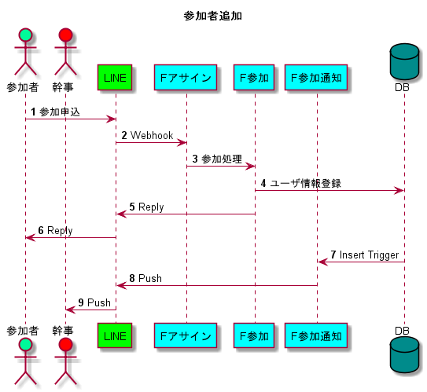
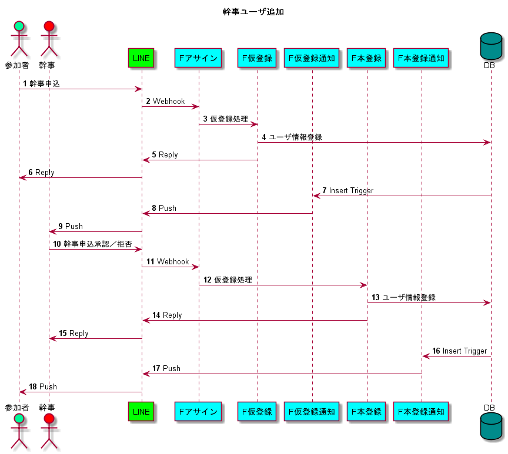
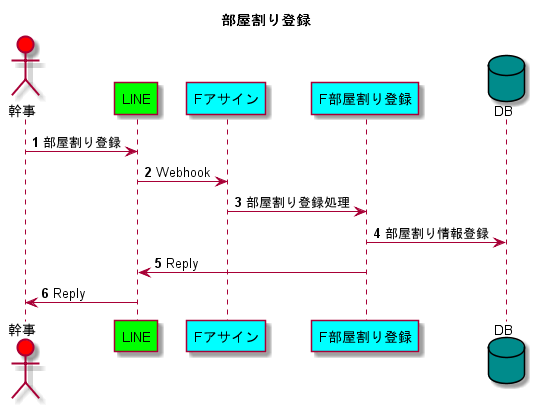
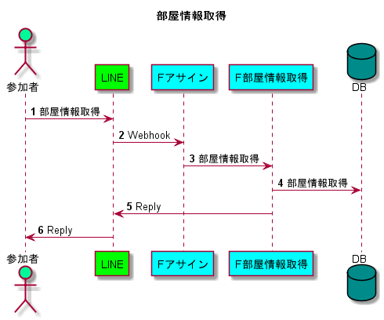

# 参加者追加
  
1. 参加者がBotを友達追加した時のイベントをトリガーにWebhookによりAPIをコールする  
1. 参加する際にDBに参加者情報を登録する  
1. DBへの登録をトリガーに幹事にPush通知を送信する  

# 幹事ユーザ追加

1. 画面上の幹事になるボタンを押す  
1. 参加者には幹事からの承認待ちであることを伝える  
1. 参加者の情報をDBに登録する  
1. DBへの登録をトリガーに幹事にPush通知を送信する  
1. 幹事はPush通知より参加者の情報を受け取る  
1. 参加者の幹事への申請を承認または拒否する  
1. 承認する場合はDBに参加者情報を登録する  
1. 登録が完了したことを幹事に伝える  
1. DBへの登録をトリガーに参加者に申請が承認されたことを伝える

# 部屋割り登録

1. 画面上の部屋割り登録ボタンを押す  
1. 部屋番号とユーザ名を入力する  
1. DBに部屋割りの情報を登録する  

# 部屋情報取得

1. 画面上の部屋情報取得ボタンを押す
1. DBより部屋情報を取得する  
